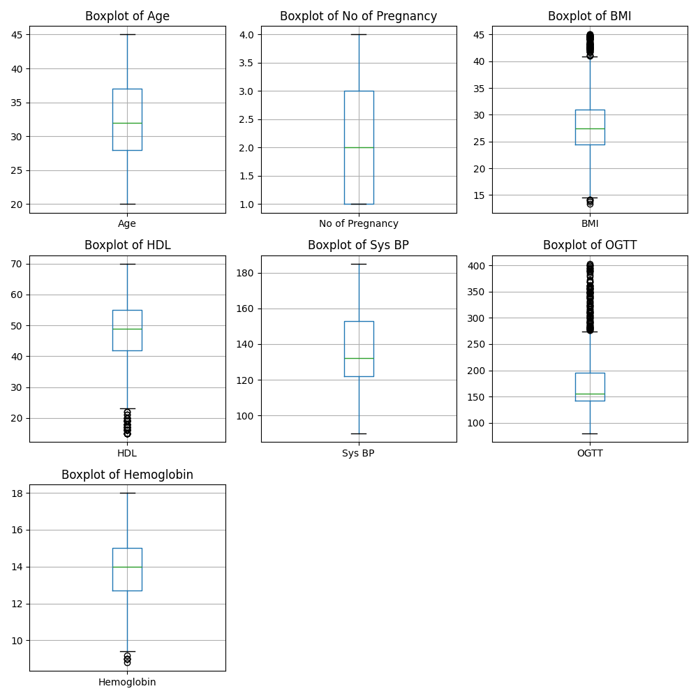

# Gestational Diabetes Early Prediction - Collaborative Project with Fetal Life

# 1. Introduction

For the Machine Learning Project, we have collaborated with Fetal Life, a Kentucky-based startup dedicated to advancing healthcare solutions. Currently, the conventional practice involves physicians assessing gestational diabetes in pregnant women around week 20 of their pregnancy. Unfortunately, by this point, the diagnosis is already confirmed, with no chance of reversal. In response to this challenge, Fetal Life is actively engaged in developing an AI/ML-based prognostic method for gestational diabetes, specifically emphasizing risk stratification.

The proposed algorithm takes into account various parameters, including age, socioeconomic status, prior perinatal health conditions, current and past health conditions, Medicaid claims data, and more. The objective is to identify pregnant women at a heightened risk for gestational diabetes, with notable indicators such as rapid or unusual weight gain during the first or early second trimesters. Subsequently, the AI/ML model will execute risk stratification and scoring.

This innovative approach enables early intervention and targeted care for women at an elevated risk for gestational diabetes before an official diagnosis is made. The ultimate aim is to prevent the onset of gestational diabetes, thereby improving the overall prognosis.

# 2. Methodology
In the initial phase of our study, we delved into the Fetal Life Dataset, comprising 26 sheets and 60827 rows. After isolating the pertinent 16 columns for our analysis, we encountered a significant imbalance in the data, with 60795 instances (99.95%) classified as False and only 31 instances (0.05%) as True. Consequently, recognizing the need for a more balanced dataset, we transitioned to a similar dataset available on Kaggle.

The Kaggle dataset, with its 3526 rows, proved to be an ideal alternative for our research. Additionally, this dataset featured several overlapping columns with our original selection. To optimize our approach, we adopted a collaborative strategy wherein each team member explored different methods, fostering subsequent discussions and mutual learning.

## 2.1 Dataset
Due to the problems presented in the Fetal Life dataset, we opted for using the publicly available GDM Data Set[^1]. This dataset comprises 3,525 cases, with 17 features:
+ **Case Number**: Unique identifier for each patient in the study.
+ **Age**: The age of the patient at the time of the study.
+ **No of Pregnancy**: Total number of times the patient has been pregnant.
+ **Gestation in previous Pregnancy**: Duration of previous pregnancies in weeks.
+ **BMI**: Body Mass Index, a measure of body fat based on height and weight.
+ **HDL**: High-Density Lipoprotein cholesterol levels, often referred to as "good" cholesterol.
+ **Family History**: Presence of gestational diabetes in the patient's family history.
+ **Unexplained prenatal loss**: History of miscarriages or infant losses without known medical explanation.
+ **Large Child or Birth Defect**: History of giving birth to a large child or a child with birth defects.
+ **PCOS**: Indicates whether the patient has Polycystic Ovary Syndrome.
+ **Sys BP**: Systolic Blood Pressure, the pressure in the arteries when the heart beats.
+ **Dia BP**: Diastolic Blood Pressure, the pressure in the arteries when the heart rests between beats.
+ **OGTT**: Oral Glucose Tolerance Test results, a test for gestational diabetes.
+ **Hemoglobin**: Concentration of hemoglobin in the blood, which can indicate various health issues.
+ **Sedentary Lifestyle**: Indicates a lifestyle with minimal physical activity.
+ **Prediabetes**: Indicates whether the patient has blood glucose levels that are higher than normal but not yet high enough to be classified as diabetes.
+ **Class Label (GDM/Non GDM)**: The classification of whether the patient has gestational diabetes mellitus (GDM) or not.

The **Class Label (GDM/Non GDM)**is distributed in 1,372 positive cases and 2,153 negative cases. This more balanced dataset can help address the issues of the Fetal Life dataset while providing a good ground for a classification problem.

The distributions of the numeric variables are as follows:

All of them appear to be normally distributed, except for OGTT, which seems to follow a log-normal distribution.

Regarding missing data, we have the following counts:
+ BMI: 1081 missing values
+ HDL: 1001 missing values
+ Systolic Blood Pressure (Sys BP): 1705 missing values
+ Oral Glucose Tolerance Test (OGTT): 513 missing values

The boxplot does not indicate the presence of significant outliers:

[^1]: Meganathan, S. (2021). *Gestational Diabetes Mellitus (GDM) Data Set*. Retrieved from [Kaggle](https://www.kaggle.com/datasets/sumathisanthosh/gestational-diabetes-mellitus-gdm-data-set)

## 2.2 Classifiers
The first approach we have evaluated in our analysis involves the deployment of an ensemble of diverse machine-learning classifiers. This method includes several stages: preprocessing of data, application of various classification algorithms, and finally, the integration of these classifiers through stacking. To ensure the robustness and reliability of our approach, we employ a 5-fold cross-validation strategy at each stage of this process. This validation method splits the dataset into five parts, using each in turn for testing while training on the remaining four parts, thus ensuring a comprehensive evaluation of the model's performance.

Our methodology is similar to the approach detailed in Sumathi & Meganathan (2022). Their research achieved a precision of 94%, a recall of 94%, an accuracy of 94.24%, and an F-score of 94%, using the same dataset. These benchmarks are crucial for our study as they provide a target for us to strive towards and surpass. By comparing our model's performance against these established metrics, we aim to ascertain if our ensemble approach can beat their approach.

### 2.2.1 Preprocessing

The OGTT values undergo a logarithmic transformation to normalize their distribution, addressing the skewness inherent in the original data. Following this, all numerical data, including these transformed values, are standardized using a Standard Scaler, ensuring that each feature contributes equally to the analysis and mitigating any issues arising from differing scales. Since the dataset lacks multicategorical variables, there's no need for categorical data encoding, simplifying the preprocessing stage. 

Imputation of missing values is conducted using an Iterative Imputer, employing a Random Forest Regressor as the estimator. This method is chosen for its efficacy in handling complex data structures and its ability to capture non-linear relationships within the data. The Iterative Imputer works by modeling each feature with missing values as a function of other features. It iteratively refines the imputations, making it particularly suitable for datasets with a considerable amount of missingness.

# 2.2.2 Classification Models

To identify the most effective models, we initially ran several machine learning algorithms without hyperparameter tuning. This was done to select models that show promising results for our classification problem. The outcomes of this comparison are presented below. The final F1-score is computed as the average across three cross-validation runs:

| Classifier         | Train F1 Score | Test F1 Score |
|--------------------|----------------|---------------|
| Logistic Regression| 0.971          | 0.971         |
| Nearest Neighbors  | 0.981          | 0.970         |
| Linear SVM         | 0.973          | 0.971         |
| RBF SVM            | 1.000          | 0.969         |
| Decision Tree      | 0.990          | 0.972         |
| Naive Bayes        | 0.941          | 0.942         |
| KNN 3              | 0.981          | 0.970         |
According to these results, the models selected for the classifier have been a Decision Tree (implemented as both a Random Forest and GBRT), RBF Support Vector Machines, and K Nearest Neighbors.

For each of these classifiers, a grid search with 3-fold cross-validation was performed to select the best hyperparameter matrix for each model. The final hyperparameters selected are:

**Random Forest Hyperparameters**
| Parameter            | Value                   |
|----------------------|-------------------------|
| class_weight         | balanced_subsample      |
| max_depth            | 10                      |
| max_features         | sqrt                    |
| min_samples_leaf     | 2                       |
| min_samples_split    | 2                       |
| n_estimators         | 100                     |

**Gradient Boosting Hyperparameters**
| Parameter            | Value                   |
|----------------------|-------------------------|
| max_depth            | 10                      |
| max_features         | sqrt                    |
| min_samples_leaf     | 2                       |
| min_samples_split    | 2                       |
| learning_rate        | 1                       |
| n_estimators         | 100                     |
| random_state         | 42                      |

**Support Vector Machine Hyperparameters**
| Parameter            | Value                   |
|----------------------|-------------------------|
| C                    | 3                       |
| gamma                | 0.1                     |
| kernel               | rbf                     |

**K-Nearest Neighbors Hyperparameters**
| Parameter            | Value                   |
|----------------------|-------------------------|
| metric               | euclidean               |
| n_neighbors          | 11                      |
| weights              | uniform                 |

# 2.2.3 Ensemble classifier
Having selected the most effective classifiers, we then explored various stacking algorithms to combine them. The performance results of these stacking algorithms are as follows:
| Model               | Train F1 Score           | Test F1 Score            |
|---------------------|--------------------------|--------------------------|
| Random Forest       | 0.9636                   | 0.9552                   |
| Logistic Regression | 0.9647                   | 0.9631                   |
| SVC                 | 0.9629                   | 0.9518                   |
Based on these results, Logistic Regression emerged as the superior classifier for blending the predictions from the individual models. Consequently, the final architecture of our ensemble classifier integrates these individual classifiers using Logistic Regression as the meta-classifier, effectively leveraging the strengths of each to enhance the overall predictive performance.

## 2.3 Neural network
### Neural Network Architecture for Gestational Diabetes Prediction

The neural network's architecture is a cornerstone in our gestational diabetes prediction project. It's anchored by an autoencoder recognized for its prowess in feature extraction. 

### Model Architecture

### Autoencoder Design
- **Input Layer**: Accepts scaled and imputed data.
- **Dense Layers**: Employs ReLU activation to unravel complex patterns.
- **Bottleneck Feature**: Focuses on key features, enhancing predictive accuracy.

### Classification Layer
- **Output Neuron**: Utilizes sigmoid activation to calculate gestational diabetes likelihood, crucial for early detection.

### Training and Evaluation

 **Dropout Regularization**: At 30%, it curtails overfitting, ensuring the model's applicability to novel data.
- **Validation Split & Early Stopping**: Overseeing performance on unseen data, halting training to avert overlearning.

- **Optimizer**: Adam optimizer for efficient learning.
- **Training Epochs**: Model trained for 50 epochs.
- **Early Stopping**: Monitors performance to prevent overfitting.
- **Accuracy Achieved**: Approximately 97%, verified by F1-score.

### Visualizations

*Neural Network Architecture: This diagram visually articulates the structure of the neural network, including the input layer, dense layers with a specific number of neurons, the dropout layer for regularization, and the output layer with a sigmoid function. It effectively communicates the complexity and flow of data through the network, from input to prediction.*

*Training and Validation Accuracy Over Epochs: The two charts depicting model accuracy and loss during training epochs offer a clear visualization of learning over time. The accuracy chart demonstrates a steady increase in both training and validation accuracy, plateauing near perfect scores. The loss chart, on the other hand, shows a rapid decrease in training loss and a more volatile but generally decreasing trend in validation loss, indicative of effective learning and convergence.*

*SHAP Analysis: The bar chart based on SHAP values reveals the impact of different features on the model's output. Features like OGTT and Prediabetes at the top signify their strong influence on the model's predictions, suggesting that changes in these values have a substantial effect on the likelihood of gestational diabetes, as determined by the model..*

# 3. Results
# 3.1 Classifiers
Our classifier approach, with 5-fold cross-validation across the complete architecture, yields the following results:
| Metric          | Train Score      | Test Score       | Sumathi et al. (2022)|
|-----------------|------------------|------------------|----------------------|
| Accuracy        | 1.0              | 0.9730           | 0.942                |
| F1 Score        | 0.9656           | 0.9631           | 0.940                |

These results surpass those reported by Sumathi & Meganathan (2022) by 0.31 percentage points in accuracy (considering the test score), positioning our approach as potentially state-of-the-art for this dataset.

Moreover, it is crucial to consider the precision-recall trade-off, especially given that false negatives in this context could be more consequential than false positives. Adjusting the classifier's threshold could enhance recall at the expense of accuracy, a strategic decision that warrants careful consideration.

This balanced evaluation underscores the effectiveness of our model while highlighting considerations for practical application.

# 3.2 Neural Network Model Evaluation

Our neural network model demonstrates robust performance in predicting gestational diabetes, as illustrated by the metrics below:

| Metric          | Precision | Recall | F1 Score |
|-----------------|-----------|--------|----------|
| Class 0 (Non-GD)| 0.99      | 0.97   | 0.98     |
| Class 1 (GD)    | 0.95      | 0.98   | 0.97     |

- For Class 0 (Non-GD), the model achieves nearly perfect precision, suggesting that when it predicts a negative GD case, it is correct 99% of the time.
- Class 1 (GD) also shows high precision, with the model correctly identifying 95% of true GD cases.
- Recall for both classes is high, especially for Class 1, where the model correctly identifies 98% of all actual GD cases.
- The F1 score is particularly impressive for both classes, indicating a strong balance between precision and recall.

From the graph:

The precision starts high and remains relatively stable even as the threshold increases, suggesting that the model maintains a good ability to correctly label positive classes as such.

The recall remains high across most threshold values but drops significantly as the threshold approaches 1. This is expected, as setting a very high threshold would mean the model rarely predicts the positive class, increasing the false negatives.

The F1 score, which balances precision and recall, remains high across a wide range of thresholds, suggesting that the model has a good balance between precision and recall for most threshold settings.

The graph indicates a model that performs consistently across a range of thresholds, with a potential drop in recall at very high thresholds. It's important to choose a threshold that aligns with the specific needs of your application, especially considering the trade-offs between missing positive cases (recall) and incorrectly labeling negative cases as positive (precision).

These results underscore the model's effectiveness in accurately classifying both GD and Non-GD cases, which is critical in clinical settings to ensure that patients receive the appropriate follow-up and care. The high recall for GD cases is particularly noteworthy, as it suggests that the model is reliable for early detection, which is paramount for timely intervention.

# 3.3 Final Model Outputs

| Model                | Train Kaggle Dataset F1  | Test Kaggle Dataset F1  | Test Fetal Life Dataset  |      Confidence Fetal life Dataset     |
|----------------------|--------------------------|-------------------------|--------------------------|----------------------------------------|
| Stacking CLassifier  |          0.9656          |        0.9631           |           0.5964         |                 0.40                   |
| Neural Network       |          1.0000          |        0.9750           |           0.7037         |                 0.18                   |

# 3.4 Evaluating Confusion Matrix

The confusion matrix displayed shows the performance of the stacked classifier. The classifier made correct predictions for 436 negative cases and 246 positive cases, which are true negatives and true positives, respectively. It misclassified 12 negative cases as positive (false positives) and 11 positive cases as negative (false negatives). Overall, the classifier demonstrates a high accuracy with a low rate of misclassification

The confusion matrix for the fetal life dataset shows that the stacked classifier correctly predicted 41 negative and 17 positive cases. However, it incorrectly classified 9 actual negative cases as positive and 14 actual positive cases as negative. The model appears to be less accurate on this dataset compared to the previous one, with higher rates of both false positives and false negatives.

# 4. Conclusions and Recommendations
# 4.1 Conclusions:
+ Key Parameters Identified: The model developed identifies critical parameters for gestational diabetes prediction, these include, Age, Hemoglobin Level, Systolic Blood Pressure, HDL Cholesterol, BMI, PCOS, Pre-Diabetes, Diastolic Blood Pressure, and OGTT. The importance of these parameters underscores the need for additional data collection in fetal life dataset.

+ Insights from the Confusion Matrix: The confusion matrix of the classifier shows a high level of accuracy in predictions. However, it also reveals a number of false positives and false negatives. While the number of false positives is relatively low, any false negatives (cases where gestational diabetes is present but not detected) are particularly concerning in a medical context. This underscores the need for continuous improvement of the model to minimize these errors.

# 4.2 Recommendations:
+ More Data: Promote thorough data gathering, particularly focusing on the crucial parameters identified.

+ Integration into Healthcare Systems: Explore partnerships with healthcare providers for real-world testing and integration of the model. This step is crucial for understanding the model's performance in a clinical setting and for further refinement.

+ Model Refinement Based on Confusion Matrix Analysis: Refine the model to reduce false negatives, ensuring that more cases of gestational diabetes are accurately identified. This could involve reevaluating the model's threshold settings or incorporating additional predictive variables.

# 5. References
Meganathan, S. (2021). *Gestational Diabetes Mellitus (GDM) Data Set*. Retrieved from [Kaggle](https://www.kaggle.com/datasets/sumathisanthosh/gestational-diabetes-mellitus-gdm-data-set)
Sumathi, A., & Meganathan, S. (2022). Ensemble classifier technique to predict gestational diabetes mellitus (GDM). Computer Systems Science and Engineering, 40(1), 313–325. https://doi.org/10.32604/csse.2022.017484
